<a name="HOLTitle"></a>
# Using the Microsoft Custom Vision Service to Perform Image Classification #

---

<a name="Overview"></a>
## Overview ##

[Microsoft Cognitive Services](https://azure.microsoft.com/en-us/services/cognitive-services/ "Microsoft Cognitive Services") is a suite of services and APIs backed by machine learning that enables developers to incorporate intelligent features such as facial recognition in photos and videos, sentiment analysis in text, and language understanding into their applications. Microsoft's [Custom Vision Service](https://azure.microsoft.com/en-us/services/cognitive-services/custom-vision-service/) is among the newest members of the Cognitive Services suite. Its purpose is to create image classification models that "learn" from labeled images you provide. Want to know if a photo contains a picture of a flower? Train the Custom Vision Service with a collection of flower images, and it can tell you whether the next image includes a flower — or even what type of flower it is.


The Custom Vision Service enables organizations to develop domain-specific image-classification models and use it to analyze image content. Examples include identifying a dog's breed from a picture of the dog, analyzing images for adult content, and identifying defective parts produced by manufacturing processes. It was recently used to [help search-and-rescue drones](https://blogs.technet.microsoft.com/canitpro/2017/05/10/teaching-drones-to-aid-search-and-rescue-efforts-via-cognitive-services/) identify objects such as boats and life vests in large bodies of water and recognize potential emergency situations in order to notify a rescue squad without waiting for human intervention.

The Custom Vision Service exposes two APIs: the [Custom Vision Training API](https://southcentralus.dev.cognitive.microsoft.com/docs/services/d9a10a4a5f8549599f1ecafc435119fa/operations/58d5835bc8cb231380095be3) and the [Custom Vision Prediction API](https://southcentralus.dev.cognitive.microsoft.com/docs/services/eb68250e4e954d9bae0c2650db79c653/operations/58acd3c1ef062f0344a42814). You can build, train, and test image-classification models using the [Custom Vision Service portal](https://www.customvision.ai/), or you can build, train, and test them using the Custom Vision Training API. Once a model is trained, you can use the Custom Vision Prediction API to build apps that utilize it. Both are REST APIs that are easily called from a variety of programming languages.

In this lab, you will create a Custom Vision Service model, train it with images of famous paintings tagged with the artists' names, and utilize the model from a Node.js app to identify the artist of paintings that you upload. Along the way, you will learn how to train a Custom Vision Service model and leverage it from your apps using REST APIs.

<a name="Objectives"></a>
### Objectives ###

In this hands-on lab, you will learn how to:

- Create a Custom Vision Service project 
- Train a Custom Vision Service model with tagged images  
- Test a Custom Vision Service model 
- Create apps that leverage Custom Vision Service models by calling REST APIs 

<a name="Prerequisites"></a>
### Prerequisites ###

The following are required to complete this hands-on lab:

- A Microsoft account. If you don't have one, [sign up for free](https://account.microsoft.com/account).
- Microsoft [Visual Studio Code](http://code.visualstudio.com) version 1.14.0 or higher
- [Node.js](https://nodejs.org) version 6.0 or higher

<a name="Resources"></a>
### Resources ###

[Click here](https://www.dropbox.com/sh/x3l1zk08sl5vi2i/AAAv4yNYPsqPgYCwyjwaJIDga?dl=0) for the folder containing the resources used in this lab. Download the Resources folder zip at that link to your computer.

---

<a name="Exercises"></a>
## Exercises ##

This hands-on lab includes the following exercises:

- [Exercise 1: Create a Custom Vision Service project](#Exercise1)
- [Exercise 2: Upload tagged images](#Exercise2)
- [Exercise 3: Train the model](#Exercise3)
- [Exercise 4: Test the model](#Exercise4)
- [Exercise 5: Create a Node.js app that uses the model](#Exercise5)
- [Exercise 6: Use the app to classify images](#Exercise6)

Estimated time to complete this lab: **45** minutes.

<a name="Exercise1"></a>
## Exercise 1: Create a Custom Vision Service project ##

The first step in building an image-classification model with the Custom Vision Service is to create a project. In this exercise, you will use the Custom Vision Service portal to create a Custom Vision Service project.

1. Open the [Custom Vision Service portal](https://www.customvision.ai/) in your browser. Then click **Sign In**. 
 
    

    _Signing in to the Custom Vision Service portal_

1. If you are asked to sign in, do so using the credentials for your Microsoft account. If you are asked to let this app access your info, click **Yes**, and if prompted, agree to the terms of service.

1. Click **New Project** to create a new project.
  
	

    _Creating a Custom Vision Service project_

1. In the "New project" dialog, name the project "Not Hot Dog," ensure that **Food** is selected as the domain, and click **Create project**.

	> A domain optimizes a model for specific types of images. For example, if your goal is to classify food images by the types of food they contain or the ethnicity of the dishes, then it might be helpful to select the Food domain. For scenarios that don't match any of the offered domains, or if you are unsure of which domain to choose, select the General domain.

	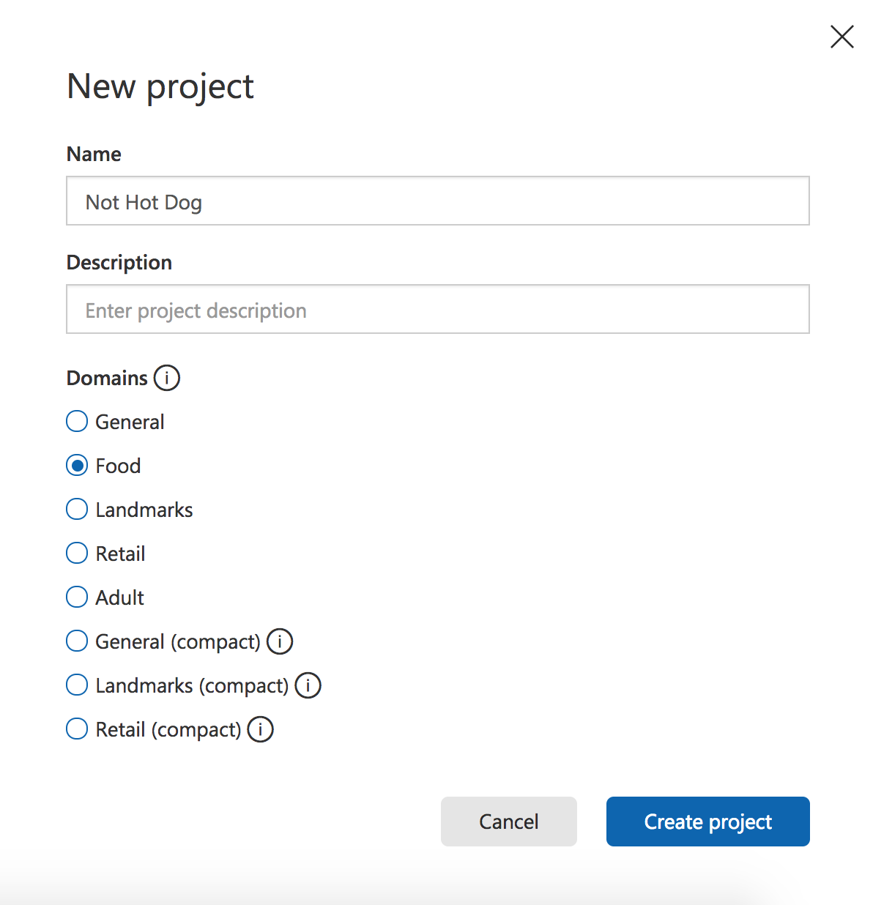

    _Creating a Custom Vision Service project_

The next step is to upload images to the project and assign tags to those images to classify them.

<a name="Exercise2"></a>
## Exercise 2: Upload tagged images ##

In this exercise, you will add images of foods that are hot dogs and not hot dogs to the Not Hot Dog project, and tag the images so the Custom Vision Service can learn to differentiate hot dogs and not hot dogs.
  
1. Click **Add images** to add images to the project.

	

    _Adding images to the Not Hot Dog project_ 
 
1. Click **Browse local files**.

	

    _Browsing for local images_ 
 
1. Browse to the "Resources\hotdogs" folder in the [resources that accompany this lab](https://www.dropbox.com/sh/x3l1zk08sl5vi2i/AAAv4yNYPsqPgYCwyjwaJIDga?dl=0), select all of the files in the folder, and click **Open**.

	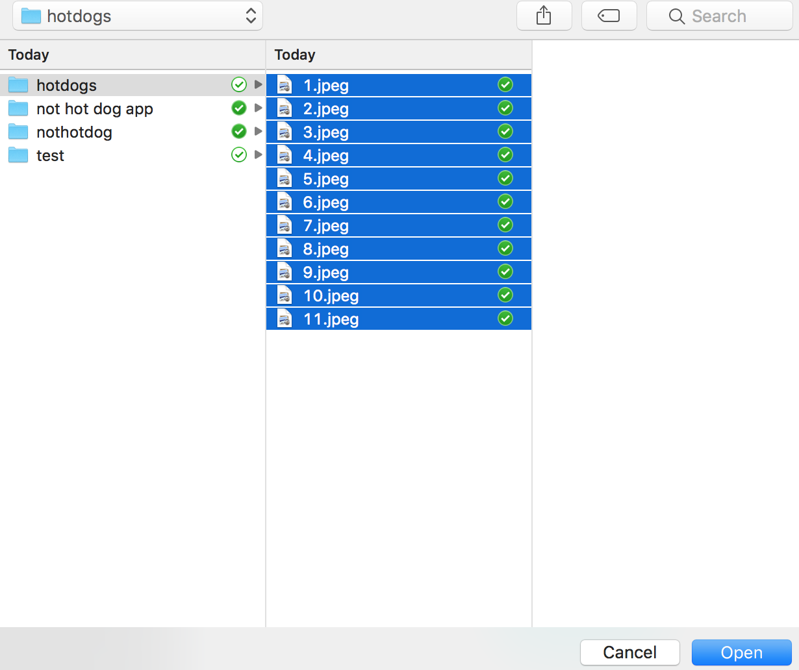

    _Selecting an image_ 
 
1. Type "hot dog" (without quotation marks) into the **Add some tags...** box. Then click **+** to assign the tag to the images.

	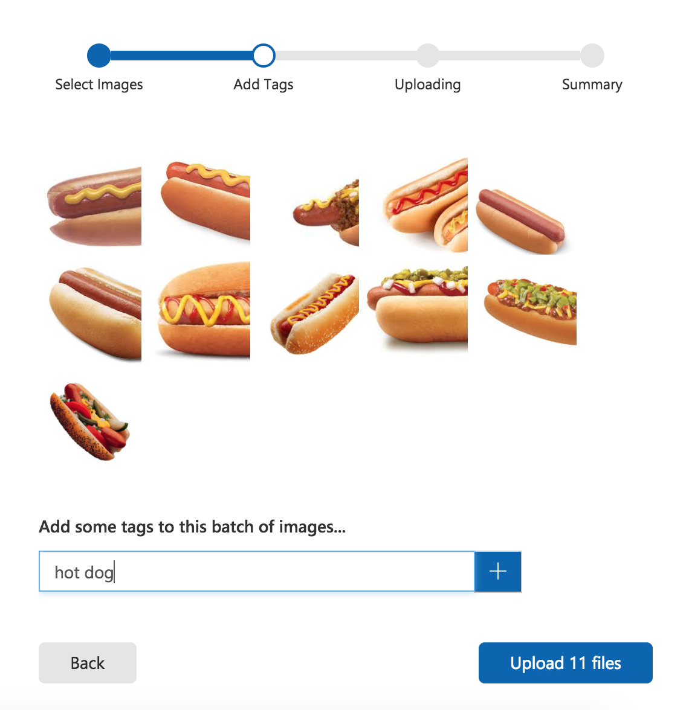

    _Adding a "hot dog" tag to the images_ 

1. Repeat Step 4 to add a "food" tag to the images.

1. Click **Upload 11 files** to upload the images. Once the upload has completed, click **Done**.

	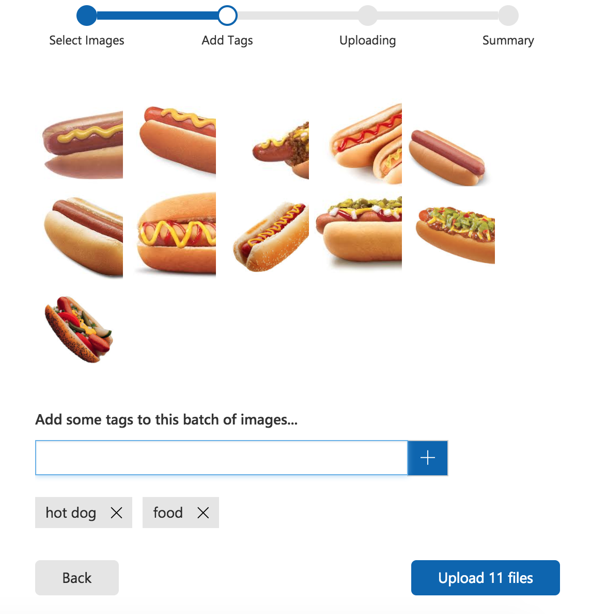

    _Uploading tagged images_ 

1. Confirm that the images you uploaded appear in the portal, along with the tags assigned to them.

	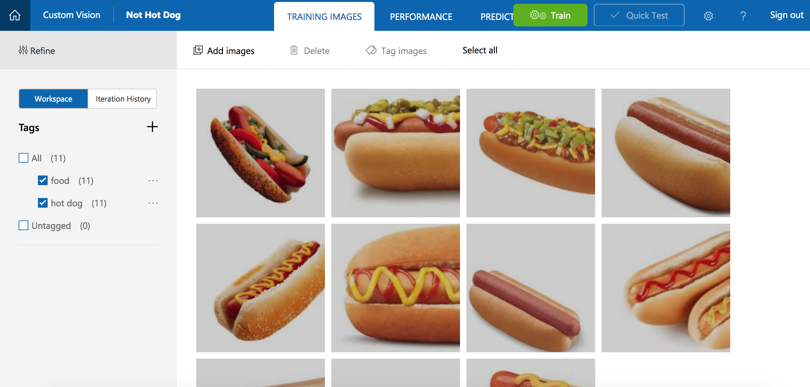

    _The uploaded images_ 

1. With eleven hot dog images, the Custom Vision Service can do a decent job of identifying hot dogs. But if you trained the model right now, it would only understand what a hot dog looks like, and it would not be able to identify other food or not hot dogs.

	The next step is to upload some pictures of other food. Click **Add images** and select all of the images in the "Resources\nothotdog" folder in the lab resources. Tag them with the labels "not hot dog" and "food" (not "hot dog"), and upload them to the project.

	> When you add the tag "food", you don't have to type it in again. You can select it from the drop-down list attached to the **Add some tags...** box, as shown below. You **will** have to type "not hot dog" and click **+** to add a "not hot dog" tag.

1. Confirm that the Not Hot Dog images appear alongside the Hot Dog images in the project, and that "Not Hot Dog" appears in the list of tags.

	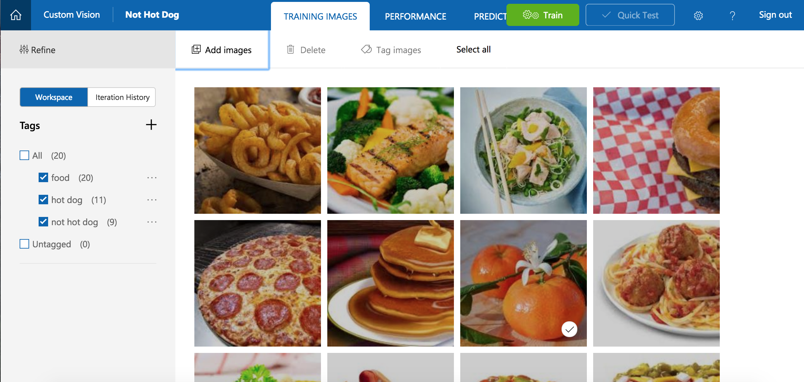

    _Hot Dog and Not Hot Dog images_ 

With the tagged images uploaded, the next step is to train the model with these images so it can distinguish between Hot Dogs and Not Hot Dogs. We can also add more tags so that it can classify Not Hot Dogs more specifically.

<a name="Exercise3"></a>
## Exercise 3: Train the model ##

In this exercise, you will train the model using the images uploaded and tagged in the previous exercise. Training can be accomplished with a simple button click in the portal, or by calling the [TrainProject](https://southcentralus.dev.cognitive.microsoft.com/docs/services/d9a10a4a5f8549599f1ecafc435119fa/operations/58d5835bc8cb231380095bed) method in the [Custom Vision Training API](https://southcentralus.dev.cognitive.microsoft.com/docs/services/d9a10a4a5f8549599f1ecafc435119fa/operations/58d5835bc8cb231380095be3). Once trained, a model can be refined by uploading additional tagged images and retraining it.
 
1. Click the **Train** button at the top of the page to train the model. Each time you train the model, a new iteration is created. The Custom Vision Service maintains several iterations, allowing you to compare your progress over time.

	

    _Training the model_

1. Wait for the training process to complete. (It should only take a few seconds.) Then review the training statistics presented to you for iteration 1. **Precision** and **recall** are separate but related  measures of the model's accuracy. Suppose the model was presented with three Hot Dogs and three Not Hot Dogs, and that it correctly identified two of the Hot Dogs as "Hot Dog" images, but incorrectly identified two of the Not Hot Dogs as Hot Dogs. In this case, the precision would be 50% (two of the four images it classified as Hot Dogs are actually Hot Dogs), while its recall would be 67% (it correctly identified two of the three Hot Dog images as Hot Dogs). You can learn more about precision and recall from https://en.wikipedia.org/wiki/Precision_and_recall.

	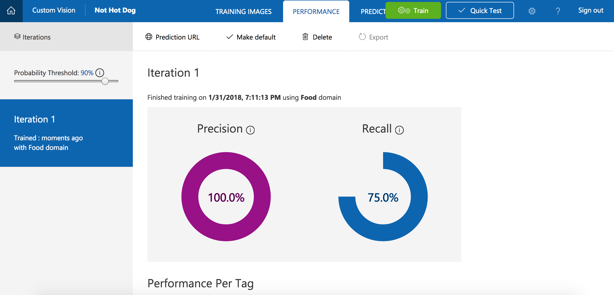

    _Results of training the model_ 

Now let's test the model using the portal's Quick Test feature, which allows you to submit images to the model and see how it classifies them using the knowledge gained from the training images.

<a name="Exercise4"></a>
## Exercise 4: Test the model ##

In [Exercise 5](#Exercise5), you will create a Node.js app that uses the model to identify the artist of paintings presented to it. But you don't have to write an app to test the model; you can do your testing in the portal, and you can further refine the model using the images that you test with. In this exercise, you will test the model's ability to identify the artist of a painting using test images provided for you.

1. Click **Quick Test** at the top of the page.
 
	

    _Testing the model_ 

1. Click **Browse local files**, and then browse to the "tests" folder in the lab resources. Select **test1.jpg**, and click **Open**.

	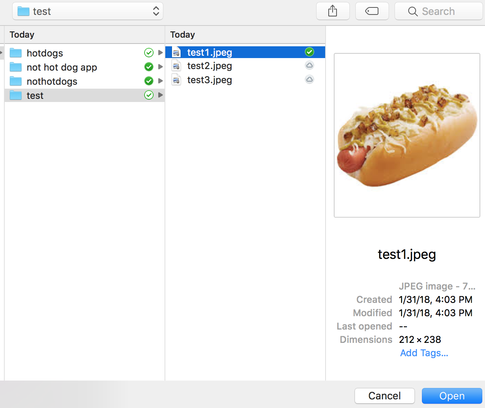

    _Selecting a Hot Dog test image_ 

1. Examine the results of the test in the "Quick Test" dialog. What is the probability that the picture is a Hot Dog? What is the probability that it is a Food or Not Hot Dog?

1. Close the "Quick Test" dialog. Then click **Predictions** at the top of the page.
 
	

    _Viewing the tests that have been performed_ 

1. Click the test image that you uploaded to show a detail of it. Then tag the image as a "Hot Dog" by selecting **Hot Dog** from the drop-down list and clicking **Save and close**.

	> By tagging test images this way, you can refine the model without uploading additional training images.
 
	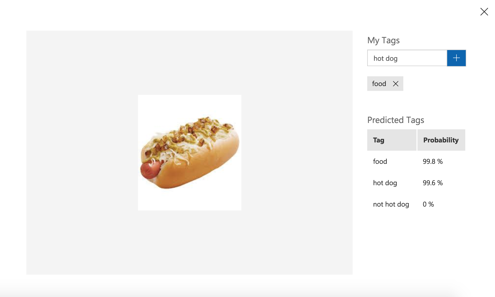

    _Tagging the test image_ 

1. Perform another quick test using the file named **test2.jpg** in the "Quick Test" folder. Confirm that this image is assigned a low probability of being a Hot Dog.

The model is trained and ready to go and appears to be adept at identifying Hot Dogs and Not Hot Dogs. Now let's go a step further and incorporate the model's intelligence into an app.

<a name="Exercise5"></a>
## Exercise 5: Create a Node.js app that uses the model ##

The true power of the Microsoft Custom Vision Service is the ease with which developers can incorporate its intelligence into their own applications using the [Custom Vision Prediction API](https://southcentralus.dev.cognitive.microsoft.com/docs/services/eb68250e4e954d9bae0c2650db79c653/operations/58acd3c1ef062f0344a42814). In this exercise, you will use Visual Studio Code to modify an app named Not Hot Dog to use the model you built and trained in previous exercises.

1. If Node.js isn't installed on your system, go to https://nodejs.org and install the latest LTS version for your operating system.

	> If you aren't sure whether Node.js is installed, open a Command Prompt or terminal window and type **node -v**. If you don't see a Node.js version number, then Node.js isn't installed. If a version of Node.js older than 6.0 is installed, it is highly recommend that you download and install the latest version.

1. If Visual Studio Code isn't installed on your workstation, go to http://code.visualstudio.com and install it now.

1. Start Visual Studio Code and select **Open Folder...** from the **File** menu. In the ensuing dialog, select the "Resources\app" folder included in the lab resources.

	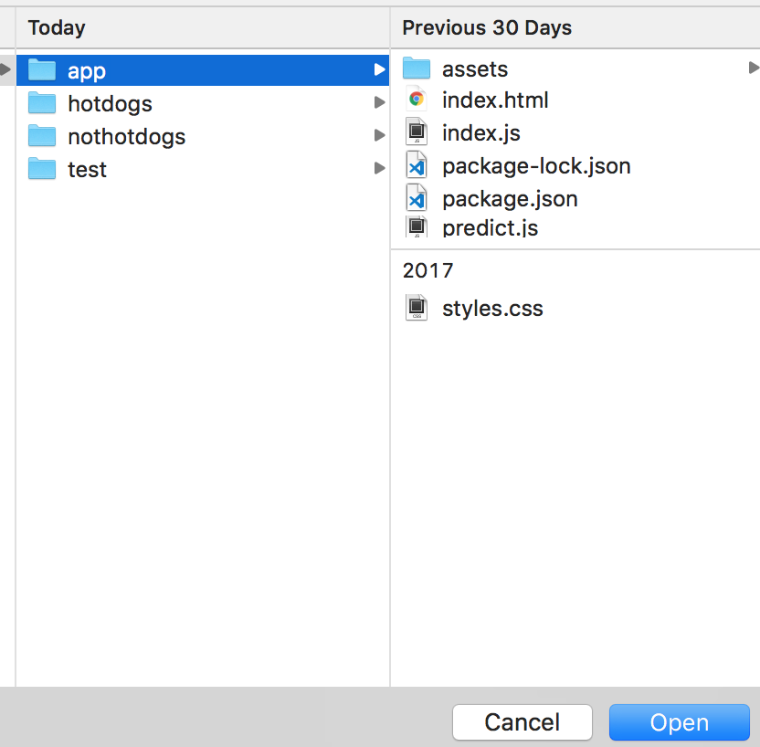

    _Selecting the app folder_ 

1. Use the **View** > **Integrated Terminal** command to open an integrated terminal window in Visual Studio Code. Then execute the following command in the integrated terminal to load the packages required by the app:

	```
	npm install
	```

1. Return to the Not Hot Dog project in the Custom Vision Service portal, click **Performance**, and then click **Make default** to make sure the latest iteration of the model is the default iteration. 

	

    _Specifying the default iteration_ 

1. Before you can run the app and use it to call the Custom Vision Service, it must be modified to include endpoint and authorization information. To that end, click **Prediction URL**.

	

    _Viewing Prediction URL information_ 

1. The ensuing dialog lists two URLs: one for uploading images via URL, and another for uploading local images. Copy the Prediction API URL for image files to the clipboard. 

	

    _Copying the Prediction API URL_ 

1. Return to Visual Studio Code and click **predict.js** to open it in the code editor.

	

    _Opening predict.js_ 

1. Replace "PREDICTION_ENDPOINT" in line 3 with the URL on the clipboard.

	

    _Adding the Prediction API URL_ 

1. Return to the Custom Vision Service portal and copy the Prediction API key to the clipboard. 

	

    _Copying the Prediction API key_ 

1. Return to Visual Studio Code and replace "PREDICTION_KEY" in line 4 of **predict.js** with the API key on the clipboard.

	

    _Adding the Prediction API key_ 

1. Scroll down in **predict.js** and examine the block of code that begins on line 34. This is the code that calls out to the Custom Vision Service using AJAX. Using the Custom Vision Prediction API is as easy as making a simple, authenticated POST to a REST endpoint.

	

    _Making a call to the Prediction API_ 

1. Return to the integrated terminal in Visual Studio Code and execute the following command to start the app:

	```
	npm start
	```

1. Confirm that the Not Hot Dog app starts and displays a window like this one:

	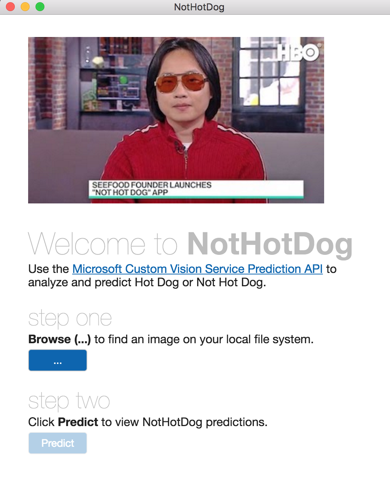

    _The Not Hot Dog app_ 

NotHotDog is a cross-platform app written with Node.js and [Electron](https://electron.atom.io/). As such, it is equally capable of running on Windows, macOS, and Linux. In the next exercise, you will use it to classify images by the type of food it is: Hot Dog or Not Hot Dog.

<a name="Exercise6"></a>
## Exercise 6: Use the app to classify images ##

In this exercise, you will use the NotHotDog app to submit images to the Custom Vision Service for classification. The app uses the JSON information returned from calls to the Custom Vision Prediction API's [PredictImage](https://southcentralus.dev.cognitive.microsoft.com/docs/services/eb68250e4e954d9bae0c2650db79c653/operations/58acd3c1ef062f0344a42814) method to tell you whether an image represents a Hot Dog, Not Hot Dog, Food or none of the above. It also shows the probability that the classification assigned to the image is correct.

1. Click the **Browse (...)** button in the NotHotDog app. 

1. Browse to the "tests" folder in the lab resources. Select the file named **test3.jpg**, and then click **Open**.

1. Click the **Predict** button to submit the image to the Custom Vision Service.

1. Confirm that the app identifies the image as a Hot Dog.

	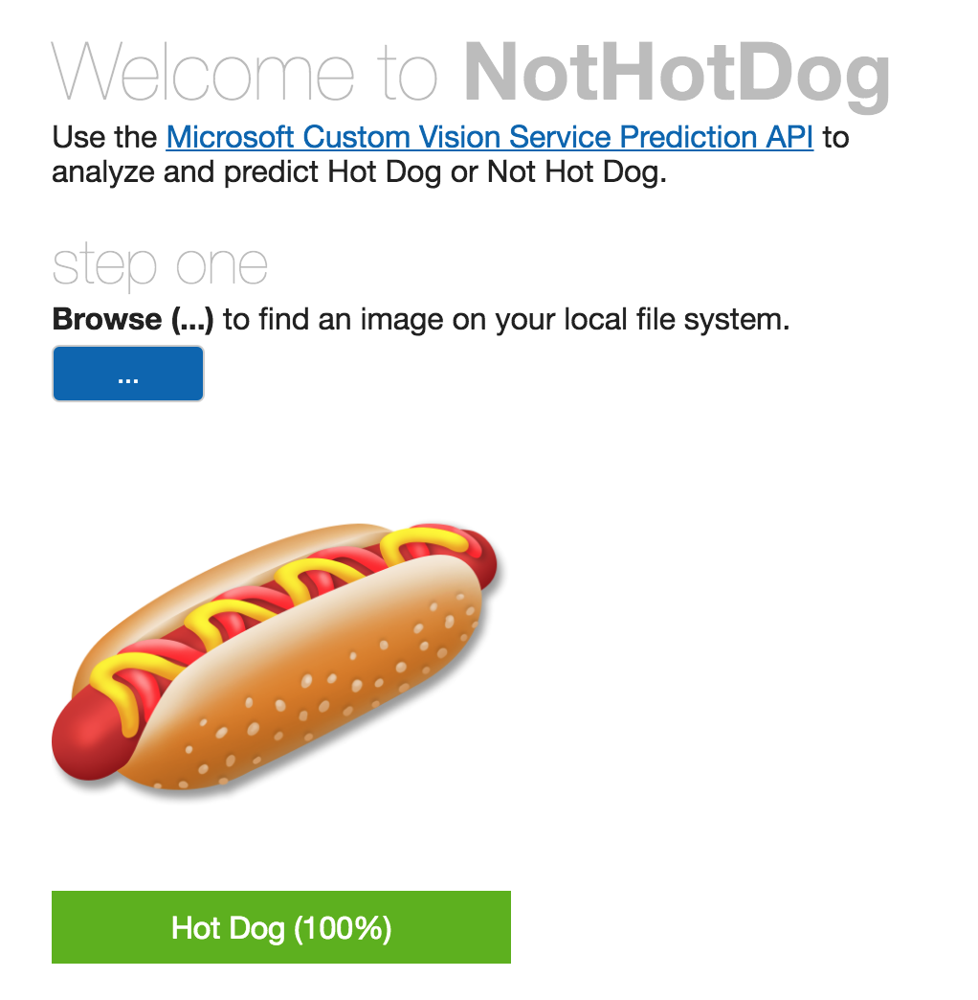

    _Classifying an image as a Hot Dog_ 

1. Repeat steps 1 through 3 for **test4.jpg** and confirm that the app can identify images as Not Hot Dogs.

	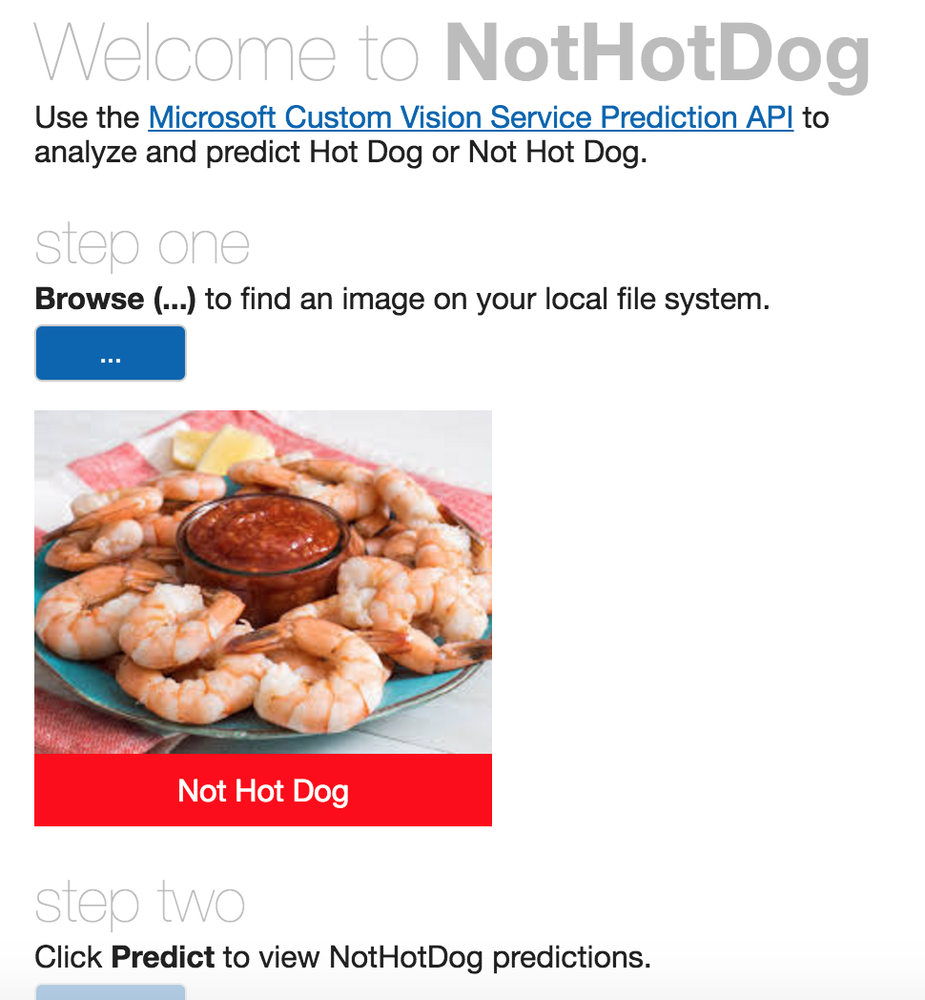

    _Classifying an image as a Not Hot Dog_ 

1. As you can see, using the Prediction API from an app is just as reliable as through the Custom Vision Service portal — and way more fun! What's more, if you go to the Predictions page in the portal, you'll find that each of the images uploaded via the app is shown there as well.
 
	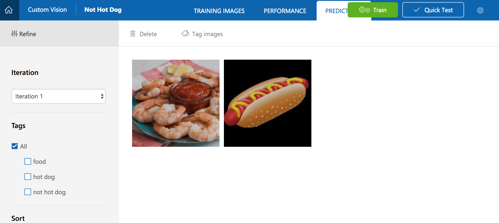

	_Images submitted to the Custom Vision Service_ 

Feel free to test with images of your own and gauge the model's adeptness at identifying different foods or determining that an image is a hot dog or not hot dog. If you'd like to train it to recognize burgers too, simply upload some burger images, tag them with "burger", and retrain the model. There is no limit to the intelligence you can add if you're willing to do the training. And remember that in general, the more images you train with, the smarter the model will be.

<a name="Summary"></a>
## Summary ##

Image classification is playing an increasingly large role in industry as a means for automating such tasks as checking images uploaded to Web sites for offensive content and inspecting parts rolling off of assembly lines for defects. Building an image-classification model manually — that is, coding it from the ground up in Python, R, or another language — requires no small amount of expertise, but the Custom Vision Service enables virtually anyone to build sophisticated image-classification models. And once a model is built and trained, an app that uses it is only few lines of code away.

---

Copyright 2017 Microsoft Corporation. All rights reserved. Except where otherwise noted, these materials are licensed under the terms of the MIT License. You may use them according to the license as is most appropriate for your project. The terms of this license can be found at https://opensource.org/licenses/MIT.
